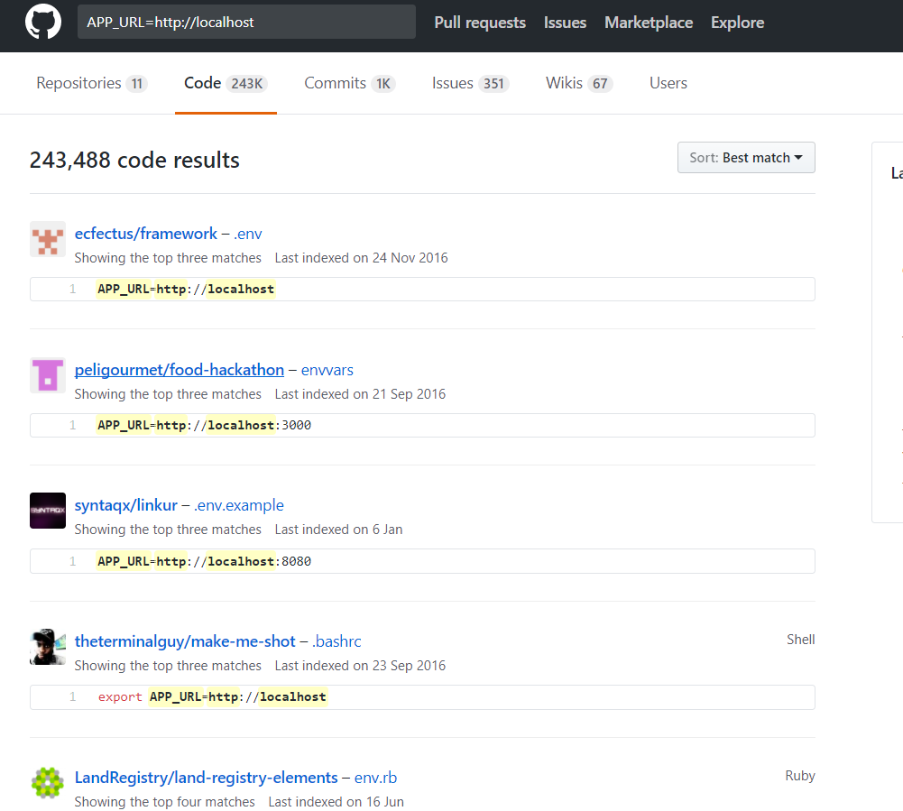
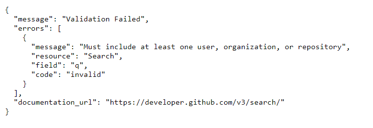
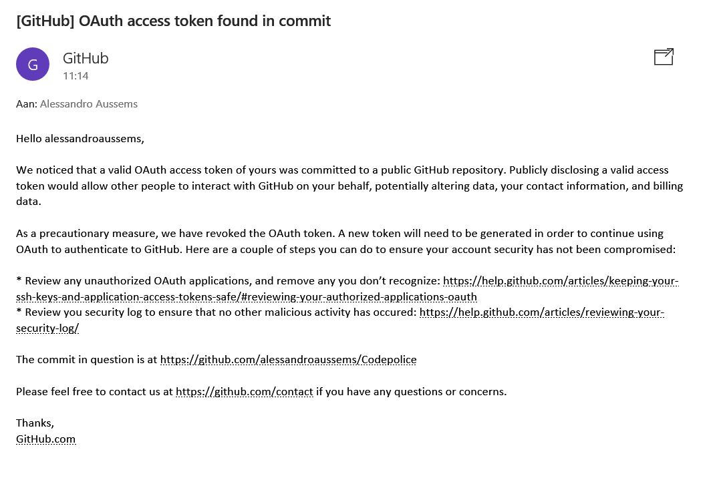
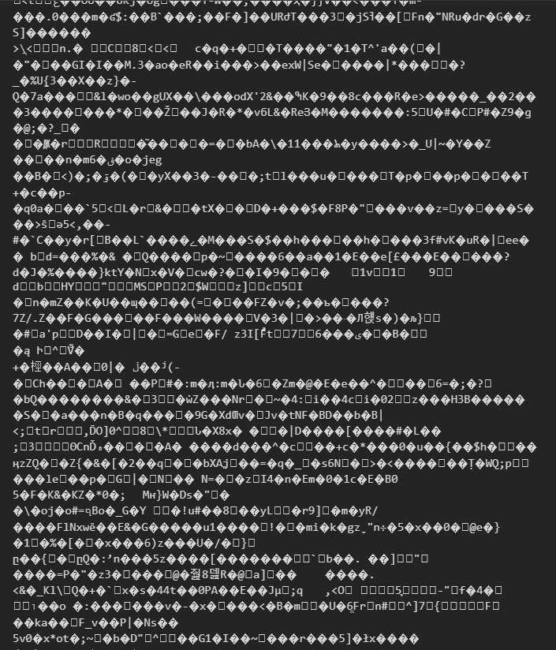
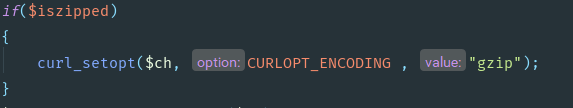
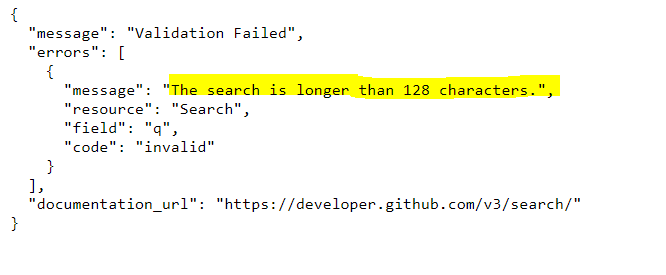

# Codepolice
Opdracht Web Research Periode 2 Proof Of Concept.
### 21/11/2017
- Goedkeuring idee
- Opzetten developmentarea
- Meerdere bronnen bekijken: (die code vergelijken)
	* http://strikeplagiarism.com/en/
	* https://github.com/jplag/jplag
	* https://www.quora.com/Are-there-any-tools-to-check-how-similar-two-source-codes-are
	* https://www.jetbrains.com/help/phpstorm/code-sniffer.html
- Search Code on Github
    * https://help.github.com/articles/searching-code/
- Github API
    * https://developer.github.com/v3/
- Finding Resemblance in code trough github:

### 28/11/2017
- Code terugvinden op het internet
    * https://searchcode.com/
- Github API aanspreken om zo code terug te vinden in verschillende repo's?
- Probleem:

- Documentatie hierover:
    * https://libraries.io/github/ainthek/git-search
    * https://help.github.com/articles/about-searching-on-github/
    * https://news.ycombinator.com/item?id=12439499
    * https://github.com/octokit/octokit.rb/issues/380
    * https://developer.github.com/changes/2013-10-18-new-code-search-requirements/
    * https://stackoverflow.com/questions/28402926/using-github-search-api-without-specifying-the-repository-or-organization
- Andere interessante bronnen:
    * https://code.google.com/
    * https://github.com/google/codesearch
    * https://about.sourcegraph.com/
    * http://opensearch.krugle.org/
    * https://developer.atlassian.com/bitbucket/api/2/reference/resource/snippets
- Google Search Code had een handige geweest MAAR! Is opgeheven :pensive:
    * https://nl.wikipedia.org/wiki/Google_Code_Search
- Toevoegen eerste versie idee in klad

### 5/12/2017
- Uitproberen GithubAPI
- Aanmaken Accestokens voor API (Anders kan er niet gezocht worden)
- Problemen met UserAgent Header in APi
- Probleem met UserAgent opgelost 
    * https://davidwalsh.name/set-user-agent-php-curl-spoof
- Checkcode.php laat nu alle repositories zien waar de zoekterm in terug komt .
- Per ongeluk OAuth Meegecommit

- Basic CSS Added
- Ajaxcall returned nu een lijst van repo's waar de code in wordt gevonden
- OAuthCode in aparte textfile gestoken en deze in de .gitignore gestoken zodat deze niet mee wordt gecommit.
### 6/12/2017
- Loadinganimation toegevoegd wanneer er word gezocht.
- Sleep in checkcodescript zodat het lijkt dat de applicatie zeer hard werkt :tongue:
### 16/12/2017
- Backend for codesearch aanpassen
- Message tonen in hoeveel github repo's de code voorkomt.
- More CSS, zodat da spel er een beetje deftig uitziet
### 18/12/2017
- Added Favico
- Some Testing
### 26/12/2017
- Styling van restart mogelijkheid
- Styling van inputveld voor de gekende Githubrepo URL
- Ingevoerde URL "strippen" van https://github.com/
- Github API roepen om zo de forks van de gekende url op te vragen
- Forks tellen
- Response array opbouwen 
- Reponse terugeven + weergeven aantal forks van githuburl
- Restart mogelijkheid
- OPGELET! Invoeren van github URL is niet verplicht!!!!!!
- Logica om zodat URL niet verplicht is => Errors verwijderd door IF loop
- Research of er een Code Search API is van Bitbucket
- Research of er een Code Search API is van Stackoverflow.
- Weining informatie over te vinden => Overgeschakeld op de vaste hulplijn
- => Stackoverflow vraag gesteld over dit onderwerp
- https://stackoverflow.com/questions/47983528/code-search-like-github-on-bitbucket-stackoverflow
### 04/01/2017
- Added Images in header because it looks nice :tongue:
- Transparantie in background want deed pijn aan de ogen
- Structural Fixes
- STACKEXCHANGE API gebruiken
https://api.stackexchange.com/
- Gebruik maken van de "search" functionaliteit
https://api.stackexchange.com/docs/search#order=desc&sort=relevance&intitle=Laravel%20Cronjob%20Dailyat%20not%20working&filter=default&site=stackoverflow&run=true
- 2de optie was om gebruik te maken van de "Advanced Search"
https://api.stackexchange.com/docs/advanced-search#order=desc&sort=relevance&q=protected%20function%20schedule(Schedule%20%24schedule)&filter=default&site=stackoverflow&run=true
- Gekozen voor de 2de mogelijkheid => Niet altijd juiste resultaten maar ze zijn wel accuraat
- Aanvragen van authenticatie op de API te kunnen gebruiken
https://stackapps.com/apps/oauth/register
- Hoe een API-call maken?
https://stackapps.com/questions/4699/how-to-make-a-stack-exchange-api-call-using-my-key
- API beginnen te proberen gebruiken
# ELENDIG LANG VASTGEZETEN MET DE ******* API
- Api returnde vage tekens...

- Reden gevonden waarom zolang vastgezeten
- API maakt gebruik van GZIP-compressie
=> 
https://stackoverflow.com/questions/14825188/getting-null-as-response-from-stack-overflow-api-with-php
Oplossing:

- Continue work...
- Added frontend/styling to show different results in own box
- Frontend for stackapi return
- Added Validation because search cannot be longer than 128chars

- Added Error when javascript is not enabled
- Minder omslachtige manier gevonden om totaal te krijgen bij de github repositories => deze was er al de hele tijd maar was over het hoofd gezien :crying:
- Manier zoeken om alle STACKvragen te krijgen
- Added Loop trough pages
- Nu worden alle resultaten van de stack API getoond!
- Enhanced LoaderAnimation
### 09/01/2018
- Added Github Pull requests
https://developer.github.com/v3/pulls/
- Added Frontend github pull requests
- Javascript aangepast zodat er geen onnodige vakjes worden getoond als het rsultaat 0 is of er geen url was ingevuld.
- Berekenen "Cheatvalue" op basis van de resultaten.
### 10/01/2018
- Diff implementation for PHP? 
http://code.iamkate.com/php/diff-implementation/
- Added files to "archive"
- Counting files in directory
https://stackoverflow.com/questions/12801370/count-how-many-files-in-directory-php
- Adding new archived file with just inputted code
https://www.w3schools.com/php/php_file_create.asp
- Diff implementation was niet wat ik verwacht had.
- Nieuw plan:
https://www.w3schools.com/php/func_string_similar_text.asp
- Similarity kan weergegeven worden in percentage via de functie.
- SimilarityArray wordt opgebouwd

