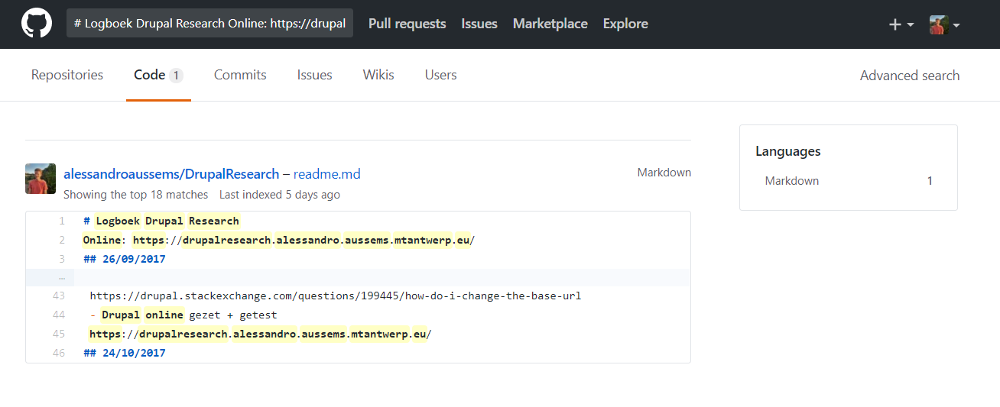

# Codepolice
Opdracht Web Research Periode 2 Proof Of Concept.
### 21/11/2017
- Goedkeuring idee
- Opzetten developmentarea
- Meerdere bronnen bekijken: (die code vergelijken)
	* http://strikeplagiarism.com/en/
	* https://github.com/jplag/jplag
	* https://www.quora.com/Are-there-any-tools-to-check-how-similar-two-source-codes-are
	* https://www.jetbrains.com/help/phpstorm/code-sniffer.html
- Search Code on Github
    * https://help.github.com/articles/searching-code/
- Github API
    * https://developer.github.com/v3/
- Finding Resemblance in code trough github:

